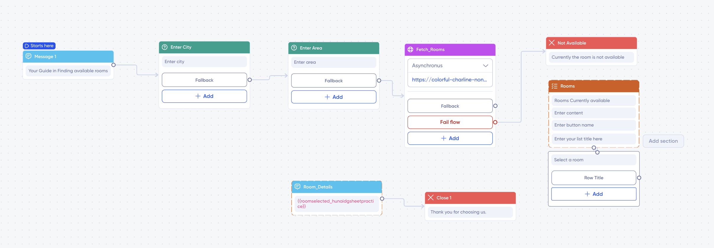
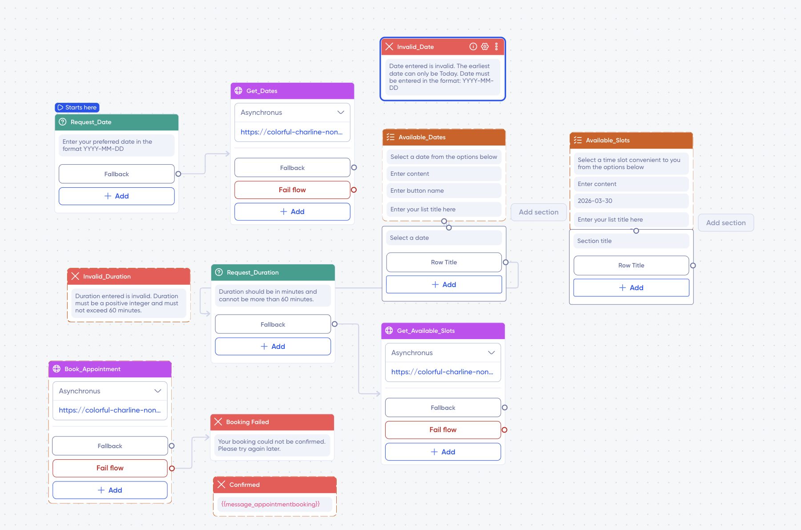
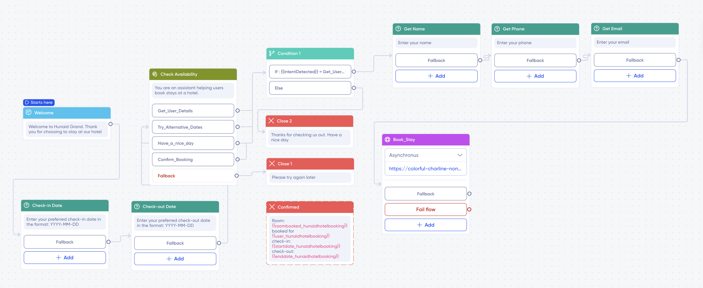

This repo contains webhooks(bots) for the bot recipies I built for practicing. 

This repo contains three recipies:

1) <u>room_booking</u>: For practicing building chatbot integrations with Google sheets.

2)  <u>appointment_booking</u>: For practicing building chatbot recipies with the Webhook blocks.

3)  <u>hotelbooking</u>: For practicing building chatbot recipies with the SmartAI blocks.

#### How to Run
For each of the recipies, 
1) copy the file `<recipe_name_dir>/bots/<recipe_name>.py` into the `bots` folder of the [bots repo](https://github.com/verloop/bots).

2) copy the inner contents of folder `<recipe_name_dir>/bots/local_services` into the `local_services` folder of the [bots repo](https://github.com/verloop/bots).

3) Rebuild the docker image for the [bots project](https://github.com/verloop/bots).

